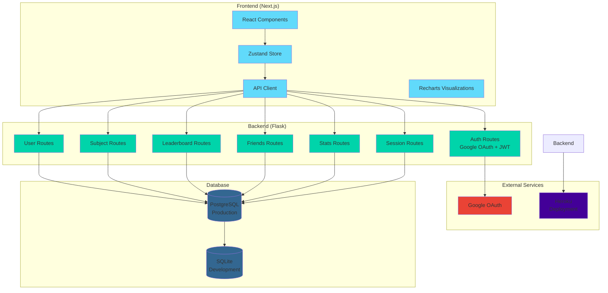

# 🎓 DoYouEvenStudyBro (DYESB?)

> A full-stack study tracking and productivity application that gamifies learning through focus session tracking, social features, and competitive leaderboards.

🌐 **Live Website**: [doyouevenstudybro.com](https://doyouevenstudybro.com)

[](https://www.python.org/)
[](https://flask.palletsprojects.com/)
[](https://nextjs.org/)
[](https://www.typescriptlang.org/)
[](https://www.postgresql.org/)

## 📸 Screenshots

### Dashboard & Weekly Overview

*Interactive weekly calendar view with subject-based session tracking, daily totals, and progress metrics*

### Ranking System

*Gamified tier-based progression system (Baus → Sherm → Squid → French Mouse → Taus) based on weekly study hours*

## 🏗️ Architecture



## ✨ Features

- **📊 Session Tracking**: Log and categorize study sessions by subject with timezone-aware timestamps
- **📈 Analytics Dashboard**: Interactive visualizations including:
  - Weekly calendar heatmap
  - Subject breakdown pie charts
  - 30-day trend line graphs
  - Year-long activity heatmap
- **🏆 Gamification**: Tier-based ranking system with 5 progression levels based on weekly study hours
- **👥 Social Features**: 
  - Friend connections with bidirectional requests
  - Friend-based leaderboards
  - Privacy controls for user data visibility
- **📋 Global Leaderboards**: Compare your study time with all users or filter by friends
- **🔐 Secure Authentication**: Google OAuth2 SSO with JWT-based API authentication
- **⏱️ Timezone Support**: Full timezone awareness for accurate session tracking across regions

## 🛠️ Tech Stack

### Frontend
- **Framework**: Next.js 16 (App Router)
- **Language**: TypeScript
- **UI Library**: React 19
- **State Management**: Zustand
- **Styling**: Tailwind CSS + shadcn/ui components
- **Visualizations**: Recharts
- **Build Tool**: Next.js built-in bundler

### Backend
- **Framework**: Flask 3.1
- **Language**: Python 3.13
- **ORM**: SQLAlchemy
- **Authentication**: Flask-JWT-Extended, Google OAuth2
- **Database Migrations**: Flask-Migrate (Alembic)
- **Server**: Gunicorn (production)

### Database
- **Development**: SQLite
- **Production**: PostgreSQL (via Heroku)

### Deployment
- **Backend**: Heroku
- **Frontend**: Vercel (recommended)

## 📁 Project Structure

```
DoYouEvenStudyBro/
├── backend/
│   ├── app/
│   │   ├── __init__.py          # Flask app factory
│   │   ├── config.py            # Configuration management
│   │   ├── models.py             # SQLAlchemy models (User, Subject, FocusSession, Friend)
│   │   └── routes/               # API blueprints
│   │       ├── auth.py           # Google OAuth & JWT endpoints
│   │       ├── sessions.py       # Study session CRUD
│   │       ├── stats.py          # Analytics & statistics
│   │       ├── friends.py        # Friend management
│   │       ├── leaderboard.py    # Global & friend leaderboards
│   │       ├── subjects.py       # Subject management
│   │       └── users.py          # User profile management
│   ├── migrations/               # Alembic database migrations
│   ├── manage.py                 # Flask CLI entry point
│   ├── requirements.txt          # Python dependencies
│   └── Procfile                  # Heroku deployment config
│
└── frontend/
    ├── app/                      # Next.js App Router pages
    │   ├── dashboard/            # Main analytics dashboard
    │   ├── tracker/               # Session tracking interface
    │   ├── leaderboard/          # Leaderboard views
    │   ├── friends/              # Friend management
    │   ├── profile/              # User profiles
    │   └── settings/             # User settings
    ├── components/                # React components
    │   ├── dashboard.tsx         # Dashboard layout
    │   ├── weekly-calendar.tsx   # Weekly heatmap
    │   ├── subject-pie.tsx       # Subject breakdown chart
    │   ├── last-30-line.tsx      # 30-day trend graph
    │   ├── year-heatmap.tsx     # Annual activity view
    │   └── ui/                   # shadcn/ui components
    └── lib/
        ├── api.ts                # API client
        ├── store.ts              # Zustand state management
        └── types.ts              # TypeScript type definitions
```

## 🚀 Getting Started

### Prerequisites
- Python 3.13+
- Node.js 18+ (or pnpm)
- PostgreSQL (for production) or SQLite (for development)

### Backend Setup

1. **Navigate to backend directory**
   ```bash
   cd backend
   ```

2. **Create and activate virtual environment**
   ```bash
   python -m venv venv
   source venv/bin/activate  # On Windows: venv\Scripts\activate
   ```

3. **Install dependencies**
   ```bash
   pip install -r requirements.txt
   ```

4. **Configure environment variables**
   Create a `.env` file in the `backend/` directory:
   ```env
   SECRET_KEY=your-secret-key-here
   JWT_SECRET_KEY=your-jwt-secret-here
   GOOGLE_CLIENT_ID=your-google-client-id
   GOOGLE_CLIENT_SECRET=your-google-client-secret
   FLASK_APP=manage.py
   DATABASE_URL=sqlite:///instance/focus.db  # For development
   # DATABASE_URL=postgresql://...  # For production
   ```

5. **Initialize database**
   ```bash
   flask db upgrade
   ```

6. **Run development server**
   ```bash
   python manage.py
   ```
   Server runs on `http://127.0.0.1:5001`

### Frontend Setup

1. **Navigate to frontend directory**
   ```bash
   cd frontend
   ```

2. **Install dependencies**
   ```bash
   pnpm install  # or npm install
   ```

3. **Configure environment variables**
   Create a `.env.local` file:
   ```env
   NEXT_PUBLIC_API_URL=http://127.0.0.1:5001/api
   NEXT_PUBLIC_GOOGLE_CLIENT_ID=your-google-client-id
   ```

4. **Run development server**
   ```bash
   pnpm dev  # or npm run dev
   ```
   Application runs on `http://localhost:3000`

## 🚢 Deployment

### Backend (Heroku)

1. **Create Heroku app**
   ```bash
   heroku create your-app-name
   ```

2. **Set environment variables**
   ```bash
   heroku config:set SECRET_KEY=your-secret-key
   heroku config:set JWT_SECRET_KEY=your-jwt-secret
   heroku config:set GOOGLE_CLIENT_ID=your-client-id
   heroku config:set GOOGLE_CLIENT_SECRET=your-client-secret
   heroku config:set DATABASE_URL=postgresql://...  # Auto-set by Heroku Postgres
   ```

3. **Deploy**
   ```bash
   git push heroku main
   ```

4. **Run migrations**
   ```bash
   heroku run flask db upgrade
   ```

### Frontend (Vercel)

1. **Connect repository to Vercel**
2. **Set environment variables**:
   - `NEXT_PUBLIC_API_URL`: Your Heroku backend URL
   - `NEXT_PUBLIC_GOOGLE_CLIENT_ID`: Your Google OAuth client ID
3. **Deploy** (automatic on push to main branch)

## 📡 API Endpoints

### Authentication
- `POST /api/auth/google` - Google OAuth authentication
- `GET /api/auth/google/callback` - OAuth callback handler

### Sessions
- `POST /api/sessions` - Create study session
- `GET /api/sessions` - List user sessions (with filters)

### Statistics
- `GET /api/stats/summary` - Get user statistics summary
- `GET /api/stats/trends` - Get trend data for visualizations

### Friends
- `GET /api/friends` - List accepted friends
- `POST /api/friends/request` - Send friend request
- `POST /api/friends/accept` - Accept friend request
- `DELETE /api/friends/:id` - Remove friend

### Leaderboard
- `GET /api/leaderboard/global` - Global leaderboard
- `GET /api/leaderboard/friends` - Friends-only leaderboard

### Subjects
- `GET /api/subjects` - List user subjects
- `POST /api/subjects` - Create subject
- `PATCH /api/subjects/:id` - Update subject
- `DELETE /api/subjects/:id` - Delete subject

### Users
- `GET /api/users/me` - Get current user profile
- `PATCH /api/users/me` - Update user profile
- `GET /api/users/:username` - Get user by username

## 🔒 Security Features

- JWT-based authentication with secure token storage
- Google OAuth2 for secure SSO
- Privacy controls for user data visibility
- Rate limiting on username changes (30-day cooldown)
- Input validation and sanitization
- CORS configuration for secure cross-origin requests
- Environment variable management for secrets

## 📊 Database Schema

### Core Models
- **User**: Authentication, profile, privacy settings
- **Subject**: User-defined study categories
- **FocusSession**: Time-tracked study sessions
- **Friend**: Bidirectional friend relationships

## 🤝 Contributing

This is a personal project, but suggestions and feedback are welcome!

## 📝 License

This project is for personal/portfolio use.

---

**Built with ❤️ for productive studying**
